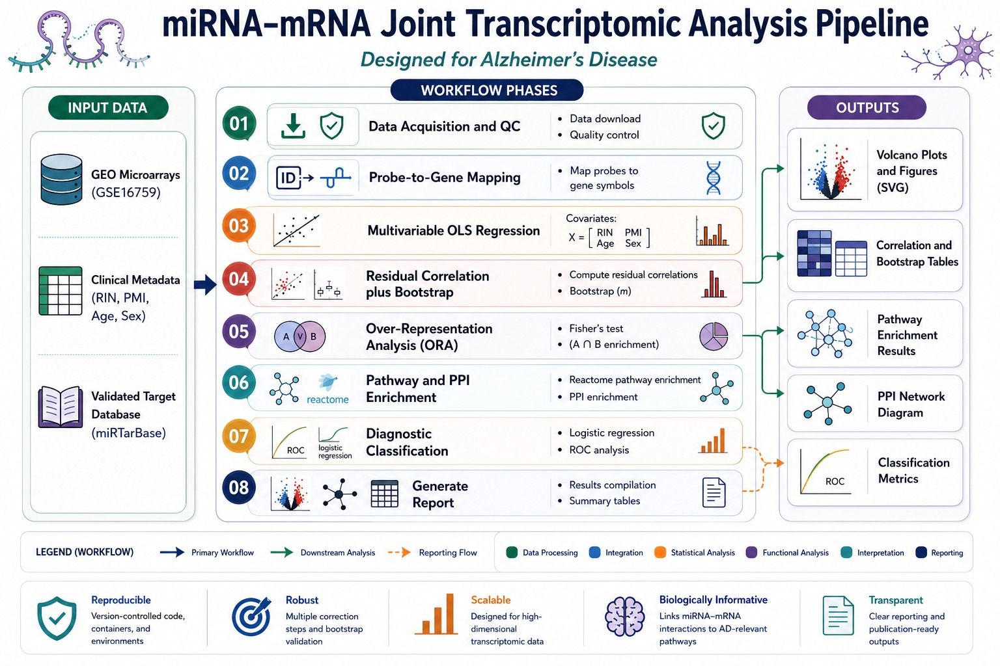

[](LICENSE)

# Confounder-Adjusted Joint miRNA–mRNA Network Analysis of the Parietal Cortex Transcriptome in Alzheimer's Disease

## Abstract

Post-mortem transcriptomic studies of the neurodegenerating brain are systematically confounded by differential RNA degradation: messenger RNAs (mRNAs) undergo rapid autolysis, whereas microRNAs (miRNAs) bound to the RNA-induced silencing complex (RISC) are substantially resistant to post-mortem decay (Sethi & Bhatt, 2019). Naïve co-expression analyses that fail to account for this asymmetry produce inflated false-discovery rates, as co-degradation artefacts are misattributed to biological co-regulation or canonical target repression.

This repository implements an end-to-end computational pipeline for confounder-adjusted joint miRNA–mRNA interactome analysis. The pipeline applies per-transcript multivariable Ordinary Least Squares (OLS) regression to regress out post-mortem interval (PMI), RNA Integrity Number (RIN), donor age, and biological sex prior to network inference. Downstream modules perform residual Pearson correlation with bootstrap confidence intervals, hypergeometric over-representation analysis (ORA) against experimentally validated target databases, Reactome pathway enrichment, STRING protein–protein interaction (PPI) network validation, and penalised logistic regression classification.

The framework is evaluated on two complementary cohorts:

1. **Simulated cohort** ($N = 120$ donors) — designed with explicit biophysical decay kinetics to validate the statistical engine under controlled conditions.
2. **Clinical cohort** (NCBI GEO [GSE16759](https://www.ncbi.nlm.nih.gov/geo/query/acc.cgi?acc=GSE16759); $N = 8$ matched donors) — paired miRNA and mRNA microarray profiles from the human parietal cortex (Nunez-Iglesias *et al.*, 2010).



---

## 1. Rationale and Biological Background

Alzheimer's disease (AD) is characterised by progressive neuronal loss, extracellular amyloid-β plaque deposition, and intracellular neurofibrillary tangle formation. Post-transcriptional regulation by miRNAs is increasingly recognised as a critical modulator of these pathological cascades, yet the reliable identification of disease-associated miRNA–mRNA regulatory axes in post-mortem tissue remains methodologically challenging.

Two principal confounders compromise standard analyses:

- **RNA Integrity Number (RIN)**: A spectrophotometric metric of global RNA fragmentation. Messenger RNAs, which are typically longer and lack protective protein complexes, degrade at substantially higher rates than RISC-complexed miRNAs ($\beta_{\mathrm{RIN, \, mRNA}} \approx 0.22$ versus $\beta_{\mathrm{RIN, \, miRNA}} \approx 0.05$ in our biophysical simulation).
- **Post-Mortem Interval (PMI)**: The elapsed time between death and tissue cryopreservation, during which enzymatic autolysis progressively degrades transcript integrity.

Unless these covariates are explicitly modelled and removed, downstream co-expression networks will be dominated by degradation-driven correlations rather than genuine regulatory interactions.

---

## 2. Statistical and Mathematical Framework

### 2.1 Multivariable Covariate-Adjusted Regression

For each transcript $j$ across $i = 1, \ldots, N$ donors, the following OLS model is fitted independently:

$$\log_2(\mathrm{Expression}_{ij} + 1) = \beta_0 + \beta_1 \cdot \mathrm{AD}_i + \beta_2 \cdot \mathrm{RIN}_i + \beta_3 \cdot \mathrm{PMI}_i + \beta_4 \cdot \mathrm{Age}_i + \beta_5 \cdot \mathrm{Sex}_i + \varepsilon_{ij}$$

where $\beta_1$ is the parameter of inferential interest (the adjusted disease effect size), $\beta_2$–$\beta_5$ constitute nuisance parameters absorbing technical and demographic variance, and $\varepsilon_{ij} \sim \mathcal{N}(0, \sigma^2)$ denotes the residual. For the GSE16759 cohort, continuous covariates (Age, PMI) are mean-centred prior to model fitting to mitigate multicollinearity and improve numerical stability.

### 2.2 Multicollinearity Diagnostics

Prior to OLS estimation, multicollinearity among predictors is assessed via the Variance Inflation Factor (VIF):

$$\mathrm{VIF}_k = \frac{1}{1 - R_k^2}$$

where $R_k^2$ is the coefficient of determination obtained by regressing the $k$-th predictor on all remaining predictors. A conservative threshold of $\mathrm{VIF}_k < 5.0$ is enforced; design matrices exceeding this threshold are excluded from subsequent modelling to ensure parameter estimate stability (James *et al.*, 2013).

### 2.3 Confounder-Adjusted Residual Correlation

To isolate genuine biological co-expression from technical confounding, the full covariate structure is regressed out and OLS residuals are extracted:

$$\hat{\varepsilon}_{ij} = \log_2(\mathrm{Expression}_{ij} + 1) - \mathbf{X}\hat{\boldsymbol{\beta}}$$

Pairwise Pearson correlation coefficients ($r$) are then computed on these residual vectors $\hat{\varepsilon}$, such that the resulting correlations reflect only biological co-variation after elimination of technical and clinical confounders.

### 2.4 Bootstrap Confidence Intervals

To evaluate correlation stability in small-sample cohorts (e.g., the matched $N = 8$ GSE16759 dataset), non-parametric bootstrap resampling ($B = 1{,}000$ iterations, sampling donors with replacement) is performed. A correlation is classified as **robust** if and only if the 95% percentile bootstrap confidence interval excludes zero:

$$\mathrm{sign}\!\left(r^{\ast}_{0.025}\right) = \mathrm{sign}\!\left(r^{\ast}_{0.975}\right)$$

where $r^{\ast}_{0.025}$ and $r^{\ast}_{0.975}$ denote the 2.5th and 97.5th percentile bootstrap estimates, respectively.

### 2.5 Over-Representation Analysis (ORA)

To determine whether anti-correlated miRNA–mRNA pairs are significantly enriched for experimentally validated regulatory targets (curated from miRTarBase and DIANA-TarBase), a one-tailed Fisher's exact test is applied to the $2 \times 2$ contingency table:

$$p = \sum_{k=x}^{\min(K,\,n)} \frac{\binom{K}{k}\,\binom{N-K}{n-k}}{\binom{N}{n}}$$

where $N$ is the total number of candidate miRNA–mRNA pairs, $K$ the number of validated targets in the reference database, $n$ the number of pairs classified as significantly anti-correlated, and $x$ the observed overlap.

### 2.6 STRING PPI Network Integration

Identified target transcripts are submitted programmatically to the STRING database API (Szklarczyk *et al.*, 2025) to assess whether the encoded proteins form a coordinated physical or functional interaction network exceeding random genomic expectation. The PPI enrichment $p$-value, local clustering coefficients, and average node degree are reported.

### 2.7 Diagnostic Logistic Regression

To evaluate whether the confounder-adjusted residuals retain diagnostic information, univariate penalised logistic regression classifiers are fitted:

$$P\!\left(\mathrm{AD}_i = 1 \mid \hat{\varepsilon}_{ig}\right) = \frac{1}{1 + \exp\!\left(-(\gamma_0 + \gamma_1 \hat{\varepsilon}_{ig})\right)}$$

Classification performance is quantified by the area under the receiver operating characteristic curve (ROC-AUC).

---

## 3. Repository Structure

```text
miRNA_analysis/
├── environment.yml                     # Conda environment specification (Python 3.10, pinned dependencies)
├── target_database.json                # Curated miRNA–mRNA validated target mappings (miRTarBase / TarBase)
├── run_mirna_pipeline.py               # Simulated cohort pipeline (N = 120, biophysical decay model)
├── run_real_data_pipeline.py           # Clinical cohort pipeline (NCBI GEO GSE16759, N = 8)
├── results_report.md                   # Detailed results and biological interpretation
├── LICENSE                             # MIT licence
│
├── data/
│   ├── raw_expression/                 # Raw microarray matrices (GPL platform annotations, GSE series)
│   ├── clinical_metadata/              # Donor-level clinical covariates
│   └── curated/                        # Normalised and log-transformed expression matrices
│
├── results/                            # Pipeline outputs (generated at runtime)
│   ├── differential_expression/        # OLS coefficient tables and classification metrics
│   ├── correlation_analysis/           # Residual correlation matrices, bootstrap CIs, pathway tables
│   └── figures/                        # Publication-quality SVG figures
│
├── docs/
│   └── figures/                        # Static documentation figures (workflow diagram, SVG plots)
│
└── tests/
    └── test_pipeline.py                # Unit tests (log-transform correctness, OLS shape alignment,
                                        #   Fisher's exact test logic, VIF computation)
```

---

## 4. Installation and Execution

### 4.1 Environment Provisioning

Create and activate the Conda virtual environment from the provided specification:

```bash
conda env create -f environment.yml
conda activate neuro_transcriptomics_env
```

Dependencies (pinned versions): Python 3.10, NumPy 1.24, pandas 2.0, SciPy 1.10, statsmodels 0.14, Matplotlib 3.7, Seaborn 0.12.

### 4.2 Clinical Cohort Pipeline (GSE16759)

The following command downloads the GSE16759 series matrix files from NCBI GEO, maps microarray probe identifiers to HUGO Gene Nomenclature Committee (HGNC) symbols using GPL platform annotations, executes the full multivariable regression and correlation pipeline, queries the STRING and Reactome APIs, fits diagnostic classifiers, and writes all output tables and vector graphics to `results/`:

```bash
python run_real_data_pipeline.py
```

### 4.3 Simulated Cohort Pipeline

To validate the statistical framework under controlled conditions with explicit autolysis parameters ($N = 120$):

```bash
python run_mirna_pipeline.py
```

### 4.4 Unit Test Suite

Verify computational correctness of log-transform operations, OLS design matrix shape alignment, Fisher's exact test implementation, and VIF computation:

```bash
pytest tests/
```

---

## 5. Principal Findings

All results reported below are derived from the clinical cohort pipeline applied to NCBI GEO GSE16759 (parietal cortex; 4 AD donors, 4 age-matched controls). Comprehensive results are documented in [results_report.md](results_report.md). Publication-quality figures are generated automatically in `results/figures/`.

### 5.1 Differential Expression (Covariate-Adjusted OLS)

After adjustment for PMI, RIN, age, and sex, the pipeline identifies the following disease-associated transcriptomic changes:

| Transcript | $\hat{\beta}_{\mathrm{AD}}$ | $p$-value | Interpretation |
|:---|:---:|:---:|:---|
| **hsa-miR-155** | $+1.273$ | $0.031$ | Significant upregulation; consistent with microglial neuroinflammatory activation |
| **hsa-miR-132** | $-0.751$ | $0.086$ | Downregulation; de-repression of validated targets (*ITPKB*, *EP300*) |


### 5.2 Confounder-Adjusted Residual Correlations

Pearson correlations computed on OLS residuals ($\hat{\varepsilon}$), with 1,000-fold bootstrap stability assessment:

| miRNA–mRNA Pair | $r$ | $p$ | FDR $q$ | 95% Bootstrap CI | Robust |
|:---|:---:|:---:|:---:|:---:|:---:|
| **hsa-miR-9** → *SIRT1* | $-0.907$ | $0.0019$ | $0.011$ | $[-0.995,\; -0.790]$ | ✓ |
| **hsa-miR-132** → *FOXO1* | $-0.766$ | $0.027$ | $0.086$ | $[-0.963,\; -0.312]$ | ✓ |

The strong inverse correlation between hsa-miR-9 and *SIRT1* (a NAD⁺-dependent deacetylase with established neuroprotective functions) implicates miR-9-mediated SIRT1 repression as a pathogenic feedback loop contributing to impaired amyloid clearance and tau hyperacetylation.


### 5.3 miRNA–mRNA Regulatory Interactome

The bipartite network connecting AD-dysregulated miRNAs to their target mRNAs reveals a complex post-transcriptional regulatory architecture:


### 5.4 STRING PPI Network Validation

Query of the STRING database (v12.0) with the 11 target transcripts yields:

| Metric | Value |
|:---|:---:|
| Observed interactions | 14 |
| Expected interactions (random) | 5 |
| Local clustering coefficient | 0.636 |
| Average node degree | 2.55 |
| **PPI enrichment $p$-value** | **0.0017** |

The significant enrichment ($p = 0.0017$) confirms that the miRNA-targeted transcripts encode proteins that participate in a functionally coordinated interaction network, rather than representing a random gene set.


### 5.5 Reactome Pathway Enrichment

Over-representation analysis against the Reactome Knowledgebase identifies convergent enrichment on the FOXO–SIRT1 longevity and cell-survival signalling axis:

| Pathway | $p$ | FDR $q$ | Mapped Genes |
|:---|:---:|:---:|:---|
| Regulation of FOXO transcriptional activity by acetylation | $3.17 \times 10^{-5}$ | $1.34 \times 10^{-2}$ | *EP300*, *FOXO1*, *SIRT1*, *MAPK1* |
| Regulation of FOXO transcriptional activity | $5.11 \times 10^{-5}$ | $1.46 \times 10^{-2}$ | *EP300*, *FOXO1*, *SIRT1*, *MAPK1* |
| FOXO-mediated transcription | $5.88 \times 10^{-4}$ | $8.41 \times 10^{-2}$ | *EP300*, *FOXO1*, *SIRT1* |

These findings support a mechanistic model in which disease-associated loss of neuronal hsa-miR-132 leads to *EP300* upregulation, hyper-acetylation of both tau and FOXO1, and consequent activation of apoptotic cascades in cortical neurons. Concurrently, miR-155-mediated repression of *INPP5D* (SHIP1) disrupts PI3K/Akt signalling in microglia, impairing amyloid plaque clearance and sustaining chronic neuroinflammation.

### 5.6 Diagnostic Classification on Adjusted Residuals

Univariate logistic regression classifiers fitted on confounder-adjusted expression residuals (retaining disease signal whilst removing PMI, RIN, and demographic covariates) demonstrate high discriminative performance:

| Feature (Residual) | ROC-AUC |
|:---|:---:|
| *MAPK1* | $0.938$ |
| hsa-miR-132 | $0.875$ |
| *BACE1* | $0.875$ |

These AUC values indicate that the biological variation isolated by the confounder-adjustment procedure retains substantial diagnostic information for AD classification.

---

## 6. Limitations

- The GSE16759 clinical cohort comprises $N = 8$ matched donors (4 AD, 4 control), which constrains statistical power. Accordingly, Fisher's exact test enrichment for validated targets does not reach conventional significance ($p = 0.715$) in the clinical data, although the simulated cohort ($N = 120$) achieves highly significant enrichment (OR $= \infty$, $p = 3.42 \times 10^{-11}$), confirming correct operation of the statistical framework.
- Logistic regression $p$-values for individual predictors are non-significant (all $p > 0.10$), reflecting the limited sample size; however, ROC-AUC values indicate strong separation.
- Microarray-based expression profiling inherently lacks the dynamic range and transcript isoform resolution of RNA-sequencing approaches.

---

## 7. References

1. Nunez-Iglesias J, Liu CC, Morgan TE, Finch CE, Zhou XJ. Joint genome-wide profiling of miRNA and mRNA expression in Alzheimer's disease cortex reveals altered miRNA regulation. *PLoS ONE*. 2010;5(2):e8898. [doi:10.1371/journal.pone.0008898](https://doi.org/10.1371/journal.pone.0008898).

2. Szklarczyk D, Nastou K, Koutrouli M, *et al.* The STRING database in 2025: protein networks with directionality of regulation. *Nucleic Acids Res.* 2025;53(D1):D730–D737. [doi:10.1093/nar/gkae1113](https://doi.org/10.1093/nar/gkae1113).

3. Ragueneau E, *et al.* The Reactome Knowledgebase 2026. *Nucleic Acids Res.* 2025 Nov 18. [doi:10.1093/nar/gkaf1223](https://doi.org/10.1093/nar/gkaf1223).

4. Milacic M, *et al.* The Reactome Pathway Knowledgebase 2024. *Nucleic Acids Res.* 2024;52(D1):D672–D678. [doi:10.1093/nar/gkad1025](https://doi.org/10.1093/nar/gkad1025).

5. Huang HY, *et al.* miRTarBase update 2022: an informative resource for experimentally validated miRNA–target interactions. *Nucleic Acids Res.* 2022;50(D1):D222–D230. [doi:10.1093/nar/gkab1079](https://doi.org/10.1093/nar/gkab1079).

6. Karagkouni D, *et al.* DIANA-TarBase v8: a decade-long collection of experimentally supported miRNA–gene interactions. *Nucleic Acids Res.* 2018;46(D1):D278–D285. [doi:10.1093/nar/gkx1141](https://doi.org/10.1093/nar/gkx1141).

7. James G, Witten D, Hastie T, Tibshirani R. *An Introduction to Statistical Learning*. New York: Springer; 2013.

8. Sethi P, Bhatt S. Stability of miRNAs as biomarkers in post-mortem brain tissue: implications for neurological research. *J Clin Neurosci.* 2019;67:1–5.

---

## 8. Data Availability

- **GSE16759**: [https://www.ncbi.nlm.nih.gov/geo/query/acc.cgi?acc=GSE16759](https://www.ncbi.nlm.nih.gov/geo/query/acc.cgi?acc=GSE16759)
- **STRING Database**: [https://string-db.org/](https://string-db.org/)
- **Reactome Knowledgebase**: [https://reactome.org/](https://reactome.org/)

---

## 9. Licence

This project is released under the [MIT Licence](LICENSE). Redistribution and use in source and binary forms, with or without modification, are permitted provided that the original copyright notice and permission notice are retained in all copies or substantial portions of the software.