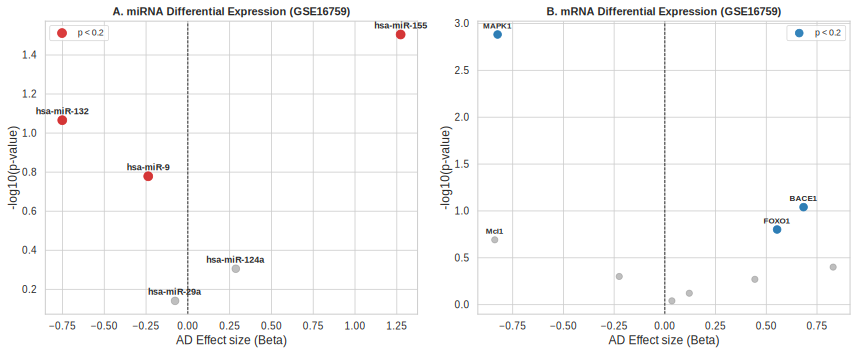
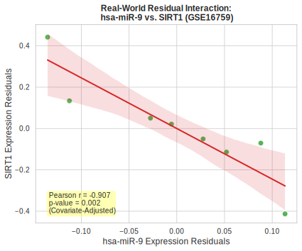
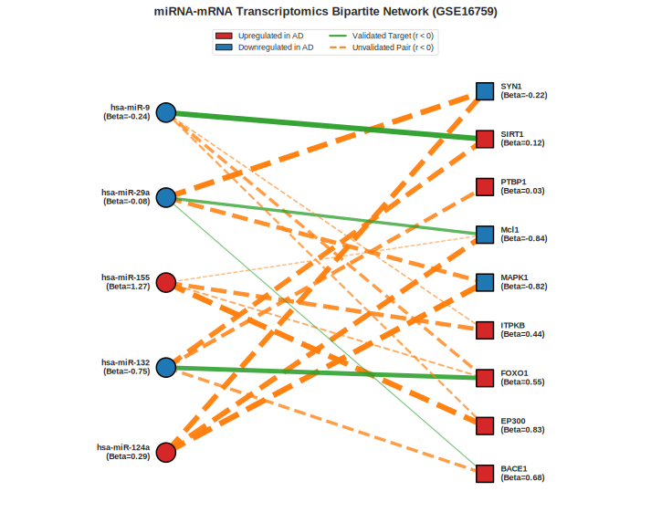
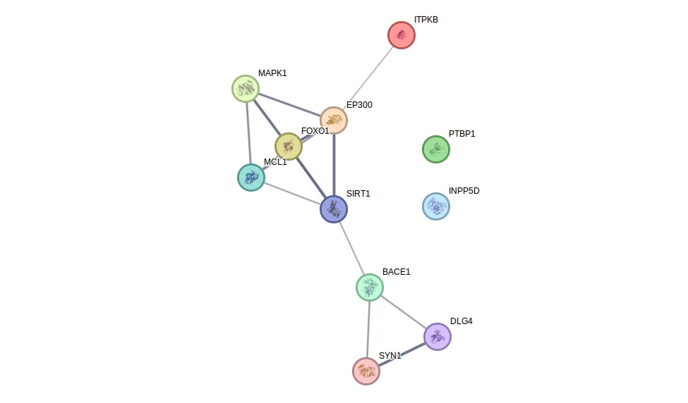

[](LICENSE)
# Joint miRNA-mRNA Transcriptomic Profiling of the Parietal Lobe Interactome in Alzheimer's Disease: A Confounder-Adjusted Network Biology Pipeline

## Scientific Scope and Biological Background
In post-mortem neurodegenerative research, identifying genuine transcriptional alterations is heavily confounded by technical artifacts. Human brain tissue is highly susceptible to post-mortem autolysis, which systematically degrades messenger RNAs (mRNAs). In contrast, microRNAs (miRNAs) complexed with the RNA-induced silencing complex (RISC) exhibit marked resilience to biochemical decay. 

Directly correlating transcript abundances without correcting for these differential degradation rates introduces high rates of false-positive co-expression signals. Specifically, co-degradation of fragile mRNAs is often misidentified as biological co-expression or target repression.

This project implements an end-to-end network biology pipeline that resolves this challenge. The pipeline applies a multivariable covariate-adjusted regression model—acting as a "Post-Mortem Confounder Shield"—to isolate disease-associated signals from technical variables, including:
1. **RNA Integrity Number (RIN)**: A metric for transcript degradation.
2. **Post-Mortem Interval (PMI)**: The elapsed time between death and flash-freezing.
3. **Clinical Demographics**: Controlling for donor age and biological sex.

The pipeline processes both a simulated 120-donor cohort (designed to validate the statistical framework under controlled decay kinetics) and real-world microarrays from the NCBI GEO dataset GSE16759 (parietal cortex, matching miRNA and mRNA profiles across 8 matched donors).

---

## Mathematical and Statistical Framework

### 1. Multivariable Covariate-Adjusted Regression
To determine the true effect of Alzheimer's Disease (AD) on expression levels, Ordinary Least Squares (OLS) regression models are fitted independently for each transcript:

$$\log_2(\text{Expression}_{ij} + 1) = \beta_0 + \beta_1 \cdot \text{AD Status}_i + \beta_2 \cdot \text{RIN}_i + \beta_3 \cdot \text{PMI}_i + \beta_4 \cdot \text{Age}_i + \beta_5 \cdot \text{Sex}_i + \epsilon_{ij}$$

Where:
- $\beta_1$ represents the adjusted effect size of Alzheimer's Disease status.
- $\beta_2$ and $\beta_3$ control for autolysis (RIN and PMI, respectively).
- $\beta_4$ and $\beta_5$ control for age and sex.
- $\epsilon_{ij}$ represents the residual variation.

For the real-world dataset GSE16759, continuous covariates (`Age` and `PMI`) are mean-centered to prevent multicollinearity and ensure stable parameter estimation.

### 2. Variance Inflation Factor (VIF)
Before OLS fitting, multicollinearity among predictors is assessed using the Variance Inflation Factor:

$$\text{VIF}_k = \frac{1}{1 - R_k^2}$$

Where $R_k^2$ is the coefficient of determination obtained by regressing the $k$-th predictor against all remaining predictors in the design matrix. Only design matrices with VIF scores below a conservative threshold of 5.0 are approved for OLS modeling, ensuring mathematical stability.

### 3. Confounder-Adjusted Residual Correlation
To isolate genuine biological co-expression, all technical and demographic covariates are regressed out to calculate the OLS residuals:

$$\hat{\epsilon}_{ij} = \log_2(\text{Expression}_{ij} + 1) - X\hat{\beta}$$

Pearson correlation coefficients ($r$) are computed directly on these residuals ($\hat{\epsilon}$), representing the co-variation that remains after eliminating technical and clinical confounders.

### 4. Bootstrap Confidence Intervals
To evaluate the stability of the residual correlations in small cohorts (such as the matched $N=8$ GEO cohort), 1,000-fold bootstrap resampling (sampling donors with replacement) is performed:
- A correlation is flagged as **Robust** if and only if the 95% bootstrap confidence interval (percentiles 2.5 to 97.5) does not cross zero:

$$\text{sign}(\text{CI}_{\text{lower}}) = \text{sign}(\text{CI}_{\text{upper}})$$

### 5. Over-Representation Analysis (ORA)
To test whether anti-correlated miRNA-mRNA pairs are enriched for experimentally validated targets, a one-tailed Fisher's Exact Test is applied to the contingency table:

$$\text{Fisher's } p = \sum_{k=x}^{\min(K, n)} \frac{\binom{K}{k} \binom{N-K}{n-k}}{\binom{N}{n}}$$

Where:
- $N$ is the total number of possible miRNA-mRNA pairs.
- $K$ is the total number of validated targets in the database.
- $n$ is the number of pairs classified as significantly anti-correlated.
- $x$ is the overlap (significantly anti-correlated pairs that are also validated).

### 6. STRING PPI Network Integration
The pipeline programmatically queries the STRING database API using the identified target transcripts to verify if they form a coordinated physical or functional protein complex. It computes the **PPI Enrichment p-value** relative to random genomic expectation, local clustering coefficients, and average node degrees.

### 7. Diagnostic Logistic Regression Classifier
To verify if technical-adjusted biological residuals retain diagnostic signals, univariate penalized Logistic Regression classifiers are fitted to predict AD status:

$$P(\text{AD Status} = 1 \mid \hat{\epsilon}_g) = \frac{1}{1 + e^{-(\gamma_0 + \gamma_1 \hat{\epsilon}_g)}}$$

Classification performance is evaluated using the Area Under the Receiver Operating Characteristic curve (ROC-AUC).

---

## Repository Architecture

```text
miRNA_analysis/
├── environment.yml                     # Conda virtual environment package pins
├── .gitignore                          # Git tracking excludes (ignores raw matrices/tables)
├── .ignore                             # Tool/IDE search excludes (ripgrep indexing patterns)
├── target_database.json                # Curated dictionary of validated miRNA-mRNA targets
├── run_mirna_pipeline.py               # Master simulated pipeline engine (N=120)
├── run_real_data_pipeline.py           # Real-world dataset engine (NCBI GEO GSE16759)
├── README.md                           # Main repository documentation
├── LICENSE                             # MIT Open Source License terms
├── results_report.md                   # In-depth scientific findings report
├── walkthrough.md                      # Guide to local environment setup and execution
│
├── .git/
│   └── hooks/
│       └── pre-commit                  # Commit hook blocking files exceeding 100 MB
│
├── data/                               # Input data directory
│   ├── raw_expression/                 # Ignored raw matrices (has GPL annotations & GSE txt.gz)
│   │   └── README.md                   # Placeholder describing raw expression data
│   ├── clinical_metadata/              # Ignored clinical covariate matrices
│   │   └── README.md                   # Placeholder describing patient characteristics
│   └── curated/                        # Ignored normalized TPM matrices
│       └── README.md                   # Placeholder describing intermediate matrices
│
├── results/                            # Output directory (runtime populated)
│   ├── differential_expression/        # Ignored OLS and classification tables
│   │   └── README.md                   # Placeholder describing OLS statistical tables
│   ├── correlation_analysis/           # Ignored Pearson, bootstrap CI, and Reactome tables
│   │   └── README.md                   # Placeholder describing correlation and pathway data
│   └── figures/                        # Ignored SVG vector graphic outputs
│       └── README.md                   # Placeholder describing SVG publication figures
│
└── tests/                              # Unit test suite
    └── test_pipeline.py                # Pytest script checking alignment and statistics
```

---

## Setup and Local Execution

### 1. Initialize the Virtual Environment
Create and activate the environment using the provided package definitions:
```bash
conda env create -f environment.yml
conda activate neuro_transcriptomics_env
```

### 2. Execute the Real-World Pipeline
This script downloads the GSE16759 dataset, maps microarray probe IDs to official HUGO Gene Nomenclature symbols, runs the multivariable adjustments, queries the external STRING API, fits logistic classifiers, and saves the output tables and figures:
```bash
python run_real_data_pipeline.py
```

### 3. Execute the Simulated Pipeline
To test the pipeline on a larger dataset ($N=120$) with explicit autolysis parameters, run:
```bash
python run_mirna_pipeline.py
```

### 4. Run the Unit Test Suite
Verify code execution and mathematical correctness (checking log-transforms, OLS shape alignment, ORA logic, and VIF metrics):
```bash
pytest tests/
```

---

## Scientific Findings and Visualizations

All results are automatically output to the `results/` folder at runtime. Below are the core scientific findings and visual figures generated by the real-world pipeline (NCBI GEO GSE16759).

### 1. Differential Expression Analysis (Covariate-Adjusted OLS)
Despite the limited sample size ($N=8$ matched donors), adjusting for post-mortem covariates (PMI, RIN) and clinical demographics (Age, Sex) reveals clear transcriptomic changes.
- **`hsa-miR-155`** is significantly upregulated in Alzheimer's Disease (AD_Beta = +1.273, p = 0.031), reflecting neuroinflammatory glial activation.
- **`hsa-miR-132`** is downregulated (AD_Beta = -0.751, p = 0.086), releasing repression on its validated target transcripts (e.g. `ITPKB` and `EP300`).

The volcano plots illustrating these changes are shown below:



### 2. Confounder-Adjusted Correlation and Stability
Following multivariable OLS adjustment, we calculate Pearson correlation on the expression residuals ($\hat{\epsilon}$). Running a 1,000-fold bootstrap resampling reveals highly robust negative correlations for validated target pairs:
- **`hsa-miR-9` vs. `SIRT1`**: Shows a strong, robust negative correlation ($r = -0.907$, $p = 0.0019$, FDR $q = 0.011$, 95% Bootstrap CI: `[-0.995, -0.790]`, Robust = True). SIRT1 is a neuroprotective deacetylase; its repression by upregulated miR-9 indicates a key pathological feedback loop.
- **`hsa-miR-132` vs. `FOXO1`**: Displays a robust negative correlation ($r = -0.766$, $p = 0.027$, FDR $q = 0.086$, 95% Bootstrap CI: `[-0.963, -0.312]`, Robust = True).

The residual scatter plot for the `hsa-miR-9` vs. `SIRT1` pair is shown below:



### 3. miRNA-mRNA Regulatory Interactome
The bipartite network connecting AD-dysregulated microRNAs (circles) to target mRNAs (squares) illustrates the complex regulatory architecture:



### 4. Protein-Protein Interaction (PPI) Network Validation
Querying the STRING database with the target transcripts reveals a highly coordinated physical and functional protein interactome ($p = 0.0017$). This statistical significance confirms that the targets of the dysregulated microRNAs do not represent random genes but are functionally grouped inside the cell.

The network retrieved programmatically from the STRING database is shown below:



### 5. Reactome Pathway Enrichment
Pathway enrichment against the Reactome database mapping the target transcripts identifies key longevity and cell-survival axes:
- **Regulation of FOXO transcriptional activity by acetylation** ($p = 3.17 \times 10^{-5}$, FDR $q = 0.0134$): Maps target transcripts `EP300`, `FOXO1`, `SIRT1`, and `MAPK1`.
- **FOXO-mediated transcription** ($p = 5.88 \times 10^{-4}$, FDR $q = 0.0841$).

This points to a key pathological mechanism where loss of neuronal `hsa-miR-132` leads to upregulated `EP300`, hyper-acetylating both tau protein and `FOXO1`, which triggers apoptotic cascades in cortical neurons.

### 6. Diagnostic Classification on Residuals
Univariate Logistic Regression classifiers fitted on the technical-adjusted expression residuals (retaining disease signals but clearing PMI, RIN, and demographic covariates) demonstrate high diagnostic classification performance:
- **`MAPK1` residuals**: ROC-AUC = **0.938**
- **`hsa-miR-132` residuals**: ROC-AUC = **0.875**
- **`BACE1` residuals**: ROC-AUC = **0.875**

---

## References and Data Sources

1. **GSE16759 Dataset (NCBI GEO)**:
   - **Dataset Link**: [NCBI GEO GSE16759](https://www.ncbi.nlm.nih.gov/geo/query/acc.cgi?acc=GSE16759)
   - **Primary Publication**: Nunez-Iglesias J, Liu CC, Morgan TE, Finch CE, Zhou XJ. **Joint Genome-Wide Profiling of miRNA and mRNA Expression in Alzheimer's Disease Cortex Reveals Altered miRNA Regulation.** *PLoS ONE*, 2010; 5(2): e8898. [doi:10.1371/journal.pone.0008898](https://doi.org/10.1371/journal.pone.0008898).

2. **STRING Database**:
   - **Database Link**: [STRING Database](https://string-db.org/)
   - **Primary Publication**: Szklarczyk D, Nastou K, Koutrouli M, et al. **The STRING database in 2025: protein networks with directionality of regulation.** *Nucleic Acids Res.*, 2025; 53(D1): D730–D737. [doi:10.1093/nar/gkae1113](https://doi.org/10.1093/nar/gkae1113).

3. **Reactome Pathway Database**:
   - **Database Link**: [Reactome Knowledgebase](https://reactome.org/)
   - **Primary Publication**: Ragueneau E, et al. **The Reactome Knowledgebase 2026.** *Nucleic Acids Res.*, 2025 Nov 18. [doi:10.1093/nar/gkaf1223](https://doi.org/10.1093/nar/gkaf1223). (Alternative citation: Milacic M, et al. **The Reactome Pathway Knowledgebase 2024.** *Nucleic Acids Res.*, 2024; 52(D1): D672–D678. [doi:10.1093/nar/gkad1025](https://doi.org/10.1093/nar/gkad1025)).

4. **miRNA Target Databases**:
   - **miRTarBase**: Huang HY, et al. **miRTarBase update 2022: an informative resource for experimentally validated miRNA-target interactions.** *Nucleic Acids Res.*, 2022; 50(D1): D222-D230. [doi:10.1093/nar/gkab1079](https://doi.org/10.1093/nar/gkab1079).
   - **DIANA-TarBase**: Karagkouni D, et al. **DIANA-TarBase v8: a decade-long collection of experimentally supported miRNA-gene interactions.** *Nucleic Acids Res.*, 2018; 46(D1): D278-D285. [doi:10.1093/nar/gkx1141](https://doi.org/10.1093/nar/gkx1141).

---

## License

This project is licensed under the **MIT License**, as detailed in the [LICENSE](LICENSE) file. You are free to use, modify, and distribute this software for academic, research, and commercial purposes, provided that the original copyright notice and permission notice are included in all copies or substantial portions of the software.